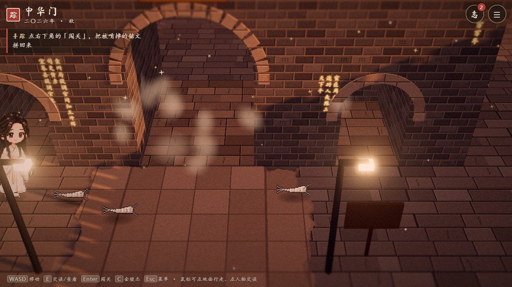
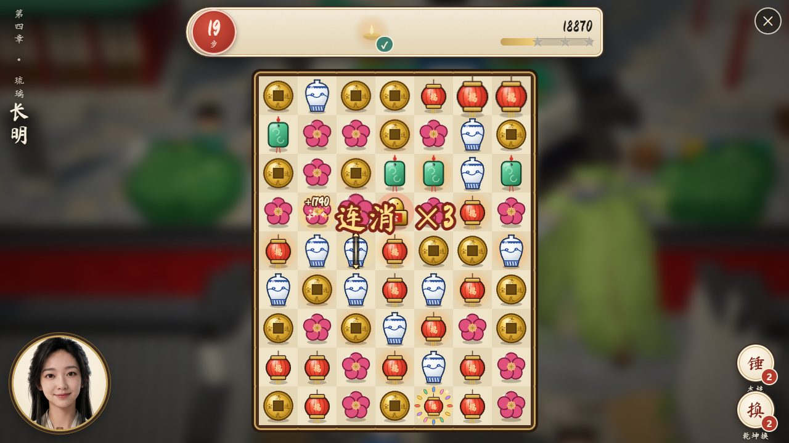
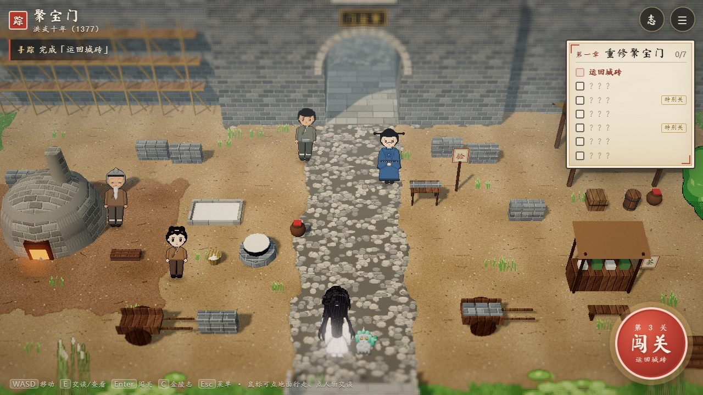
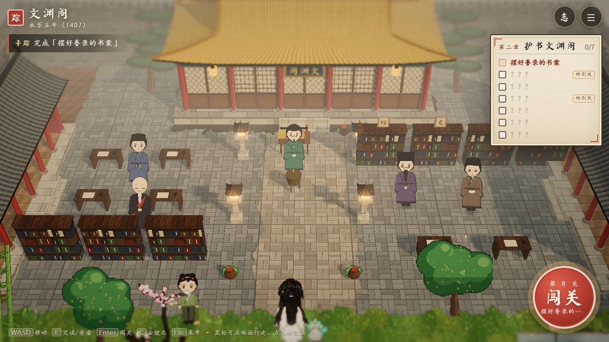
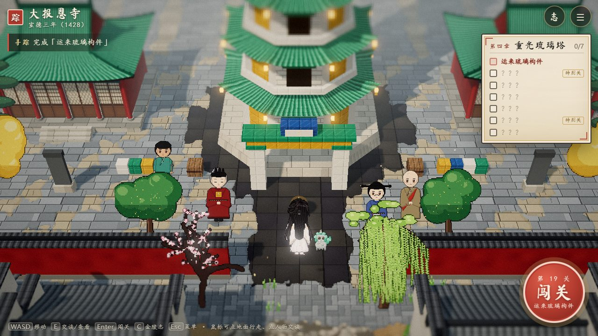

# 金陵寻踪

> 一砖一名 · 六百年

一部以**康晔**为主角、以明代南京为舞台的「消消乐 + 场景修复」网页游戏，**由 Anthropic 的 AI 助手 Claude 开发**。

## 在线试玩

- **在线试玩**：<https://lzw351878222.github.io/claude-jinling-game/>
- **离线**：下载 [`docs/index.html`](docs/index.html)，双击用浏览器打开即可（电脑、手机都能玩）

## 由 Claude 开发

这个游戏的玩法设计、剧情与对白、3D 场景与像素人物生成、消消乐引擎与 30 个关卡、9 个特别关小游戏、用 Web Audio 实时合成的音乐音效、60 篇「金陵志」词条的考证，以及仓库里的全部代码，都由 **Claude**（Claude Opus 5.5，在 [Claude Code](https://claude.com/claude-code) 里）编写完成。开发过程中，Claude 还把音频引擎、关卡设计与数值调校、小游戏实现等工作分派给并行的子代理，并用无头浏览器自动试玩、截图来检查效果。

**本仓库没有一行代码是人手写的。** 仓库作者只通过对话提出需求、做决定、试玩反馈，并提供了主角康晔的人物素材；画面里康晔的立绘、像素形象和标题图，也由 Claude 从这些素材加工生成（`tools/process_assets.py`）。

> **English** — *Jinling Xunzong* ("Tracing Jinling") is a match-3 + scene-restoration web game set in Ming-dynasty Nanjing, **built entirely by Claude (Claude Opus 5.5) in Claude Code** — game design, story and dialogue, a Three.js HD-2D scene engine, the match-3 engine with 30 levels, 9 mini-games, procedurally synthesized music and sound, and a 60-entry history codex. No line of code in this repository was written by hand; the human author only gave directions and feedback through chat and supplied photos of the protagonist. Play it in the browser: <https://lzw351878222.github.io/claude-jinling-game/>

## 截图

| | |
| --- | --- |
|  |  |
| 标题画面 | 序章 · 被蠹啃掉的城砖铭文重新亮起 |
|  |  |
| 消消乐 · 连消 | 第一章 · 洪武十年的聚宝门工地 |
|  |  |
| 第二章 · 永乐五年的文渊阁 | 第四章 · 宣德三年的大报恩寺 |
|  |  |
| 第五章 · 万历十五年上元节的秦淮河 | 终章 · 与遗忘之蠹的消消乐对决 |
|  | |
| 终章 · 「问史」答题对决 | |

## 故事

二〇二六年秋天的黄昏，康晔在中华门的藏兵洞里，看见一块城砖上刻着自己的名字。一只从明孝陵神道上溜出来的小石麒麟「阿麟」告诉她：有一种叫「蠹」的东西，正在啃食历史的踪迹。于是她穿过时之隙，走进洪武、永乐、宣德、万历年间的金陵——每闯过一关，被啃掉的踪迹就修复一处。

整个游戏是**一个自包含的 HTML 文件**，画面、音乐、音效全部由代码实时生成，不依赖任何外部资源，双击即可在浏览器里打开，也可以直接放到任何静态托管上。

## 怎么玩

每一章是一处 HD-2D 风格的 3D 场景，右上角是本章的「修复清单」，右下角是「闯关」按钮：

- **消消乐**：拖动（或先后点选）两颗相邻的棋子交换，三个相同即可消除。
  - 四连 → 「笔」，扫掉一整行或一整列
  - L / T 形 → 「烟花」，炸开周围一圈
  - 五连 → 「宝印」，清掉场上同一种纹样
  - 两个特效互换还能组合出更大的效果
  - 障碍：墨渍、绳索、碎砖、会蔓延的蠹、长明灯；以及要运到底部的城砖、大典、丝绸、琉璃构件、荷花灯
  - 步数用完时，阿麟可以借你五步（每局一次）；还有「木槌」「乾坤换」两件道具
- **特别关**：验砖、窑火、捉蠹、经史子集、牵星过洋、转瓦、点灯、刻版，以及终章的「问史」对决
- **场景里**可以自由走动，和人物交谈、查看发光处，会收录「金陵志」词条、解锁成就

| 操作 | 电脑 | 手机 |
| --- | --- | --- |
| 移动 | WASD / 方向键，或鼠标点地面 | 左下摇杆，或点地面 |
| 交谈 / 查看 / 推进对话 | E / 空格 / 回车，或点人物 | 右下「行」按钮，或点人物 |
| 闯关 | 回车，或点「闯关」 | 点「闯关」 |
| 金陵志 / 菜单 | C / Esc | 右上角按钮 |

进度自动存档（浏览器 localStorage），菜单里另有三个手动存档位。金陵志和成就跨存档保留。

## 内容

| 章 | 年代 · 地点 | 关卡 | 特别关 |
| --- | --- | --- | --- |
| 序章 · 城砖上的名字 | 2026 · 中华门 | 2 | — |
| 第一章 · 窑火 | 洪武十年（1377）· 聚宝门工地 | 5 | 验砖、窑火 |
| 第二章 · 文渊 | 永乐五年（1407）· 文渊阁 | 5 | 捉蠹、经史子集 |
| 第三章 · 星槎 | 永乐十三年（1415）· 龙江宝船厂 | 6 | 牵星过洋 |
| 第四章 · 琉璃 | 宣德三年（1428）· 大报恩寺 | 5 | 转瓦、点灯 |
| 第五章 · 灯市 | 万历十五年（1587）· 秦淮河 | 6 | 刻版 |
| 终章 · 金陵 | 时之隙 | 1（Boss） | 问史 |
| 尾声 · 名字 | 1386 聚宝门 · 2026 中华门 · 明孝陵石象路 | — | — |

共 30 个消消乐关卡、9 个特别关、60 篇考证过的「金陵志」词条、60 道问史题、23 个成就。登场人物包括朱元璋与马皇后、解缙、姚广孝、沈度、郑和、马欢、海瑞、汤显祖等。

## 构建

需要 Node.js 18+ 和 Python 3（`fonttools`、`brotli`，用于裁剪书法字体子集）：

```bash
npm install
pip install fonttools brotli
npm run build          # 生产构建 → dist/index.html
npm run dev            # 开发构建 + 监听 + 本地服务 http://localhost:5173
```

构建脚本（`build.mjs`）会扫描源码里出现过的全部汉字，把马善政毛笔楷书裁成子集后以 base64 内联，再用 esbuild 把全部模块、样式和图片打包进单个 HTML。

开发辅助：

```bash
node tools/m3-levels-sim.mjs 200     # 用贪心机器人把 30 关各跑 200 局，检查不变量与难度
node tools/mg-build.mjs star         # 单独调试某个特别关 → dist/mg-star.html
node tools/autoplay.mjs 600          # 无头 Chrome 自动试玩并截图（需先 npm run dev）
```

开发构建里可以用 `index.html?ch=3&step=2` 直接跳到某章某步。

## 目录

```
src/
  main.js            入口：加载画面 → 标题
  game/              应用主控（app）、剧情导演（director）、修复清单与闯关按钮（hub）、标题、片尾、存档
  engine/            HD-2D 场景引擎（three.js）：地形、建筑生成器、像素人物、光照、粒子、镜头
  m3/                消消乐：逻辑、渲染、控制器、界面、30 个关卡
  minigames/         9 个特别关与共用宿主
  story/             各章地图与剧本、金陵志、题库、成就
  core/audio*        Web Audio 合成的音乐、环境声与音效
  ui/                对话、菜单、金陵志、设置
  assets/            康晔的立绘、像素精灵与标题图（由 tools/process_assets.py 从「人物素材」生成）
```

## 致谢

- 字体：马善政毛笔楷书 Ma Shan Zheng（SIL Open Font License 1.1，见 `tools/fonts/OFL.txt`）
- 3D：three.js（MIT）
- 史料：《明史》《礼记·月令》《瀛涯胜览》《武备志·郑和航海图》《天工开物》《梦溪笔谈》《陶庵梦忆》《牡丹亭》等，以及南京城墙、大报恩寺遗址、龙江宝船厂遗址的考古资料。游戏中的人物对话为虚构；「金陵志」中史实有争议之处均已注明。

献给喜欢明朝的康晔。
